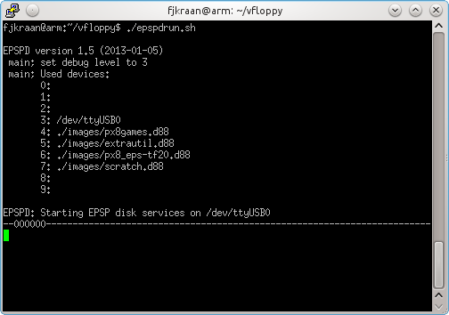
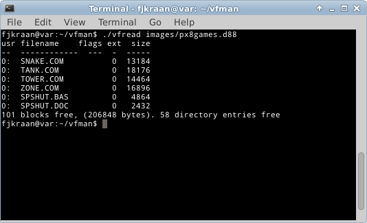

<H2>Intro</H2>

Vfloppy is a disk simulator for the Epson PX-4 and PX-8. It uses the
 epsp protocol used by the Epson TF-15, TF-20, PF-10 and compatible disk
 stations. It is written in C for Linux, and should be portable to any *nix
 with standard libraries, including even Windows. Apart from the program, 
 only a serial port and a cable to connect it to the PX-4 or PX-8  is needed.

<H2>Origin</H2>

The original version, written by Justin Mitchell and friends, consisted
only of a TF-15 simulator for the PX-4 and a formatter to create empty images. 
The floppy images were files containing only the sector information of the 
tracks 4 and up, as the lower tracks are not used by CP/M. This format uses 
the extension ".vfd".

<H2>Utilities</H2>

The versions 1.1 to 1.4 add support for the PX-8, and a read and write 
utility to transfer files between the images and the file system. Due to a 
bug, only file sizes below 32 kByte are supported by these utilities.
These versions of the utilities use functions which make them less ideal 
for porting to Windows.

<H2>Emulators and D88</H2>

With the advent of the PX4 and PX-8 emulators, a new floppy image format 
appeared, Pasopia D88. As this format contains the complete floppy (also 
tracks 0 to 3), the simulator could in principle also support the HX-20 
command set.

The 2.0 version of the simulator is an almost complete rewrite based 
on the Epson protocol description. This was done to make extension of the 
command set doable. By the way, only the basic commands for reading and 
writing are supported, the commands for formatting and disk copy are not. 
Having those too would be nice, but not really needed as these operations 
can be done on the host computer.

As there appeared to be no read and write utilities for the Epson 
PX-4/8 D88 format on the host side, I converted the simulator and 
utilities to this format.

Another advantage of the rewrite is that the source can be made more 
portable. The 2.0 version of the utilities can be compiled from the same 
source for both Linux and Windows, and both executables are included.

The simulator isn't available on Windows, due to lack of time and 
clean, portable code to support the serial port on both platforms. 

See for more info the web site http://electrickery.nl/comp/px4/vfloppy/

